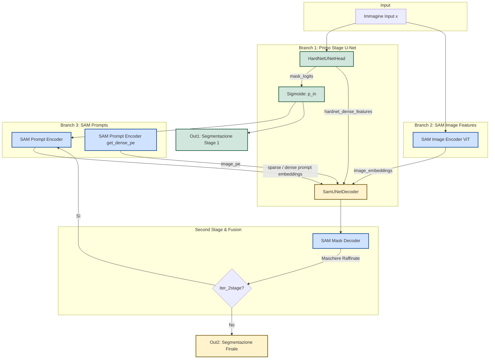

# Architettura HardNet-SAM U-Net (`_unet`)

Questo documento descrive dettagliatamente l'architettura del modello `_unet` (definito come `HardNetFeatSegUNet`), spiegando il ruolo dei vari moduli e il flusso dei dati all'interno della rete. Questo modello combina l'efficienza locale e spaziale di un'architettura U-Net (basata su block HardNet) con le potenti capacità di comprensione del contesto e zero-shot di Segment Anything Model (SAM).

## 1. Diagramma dell'Architettura

Il seguente diagramma Mermaid mostra il flusso dei dati dal momento in cui l'immagine entra nel modello fino alla generazione della maschera finale (Second Stage).

## 2. Spiegazione delle Variabili (Linee 149-182 di `build_sam_unet_model.py`)

In questa porzione di codice si definiscono e si istanziano i blocchi fondamentali (building blocks) che comporranno il modello finale.

### `mask_decoder = MaskDecoder(...)`
È il decodificatore nativo di SAM. Sfrutta un Transformer a due vie (Two-Way Transformer) per far interagire i prompt utente (in questo caso, la prima maschera generata in automatico) con i feature embeddings dell'immagine. Il suo unico scopo è restituire una maschera accurata basata principalmente su informazioni globali.

### `sam_unet_dec = SamUNetDecoder(mask_decoder=mask_decoder)`
È un **wrapper modulare / blocco di fusione** che avvolge il `MaskDecoder` originale. A differenza del SAM standard, questo modulo custom prende in input sia le feature "globali" di SAM (gli *image_embeddings*) sia le feature "locali" molto più dense generate dalla HardNet (*hardnet_dense_features*). Il suo compito è fondere queste informazioni spaziali ad alta risoluzione in modo da permettere a SAM di non perdere i dettagli più piccoli (es. micro lesioni).

### `hardnet_unet_stage = HardNetUNetHead(...)`
È la rete "First Stage" responsabile dell'estrazione di base. È una U-Net altamente ottimizzata che sfrutta come spina dorsale un modello HardNet (es. HarDNet68/85). Al contrario delle vecchie versioni, questa U-Net non butta via le mappe di feature intermedie, ma restituisce in output **due cose**:
1. Una prima stima grezza della segmentazione (`mask_logits`).
2. Una serie di tensori ad alta risoluzione (`hardnet_dense_features`) contenenti i dettagli fini dei bordi e delle texture, che altrimenti SAM perderebbe a causa degli ampi step del ViT (patch size 16x16).

### `sam_seg = HardNetFeatSegUNet(...)`
Questo è il collante, il **Top Level Model**. Prende tutte le parti appena definite (ViT di SAM, Prompt Encoder, Stage 1 U-Net, Stage 2 Decoder di fusione) e costruisce la pipeline `forward()`. Gestisce le interpolazioni o resize necessari tra i vari branch.

---

## 3. Il Flusso dei Dati (`forward`)
Quando un'immagine `x` entra nel modello, i dati attraversano il seguente percorso logico:

1. **Elaborazione Parallela Multi-Risoluzione**
   - **Branch SAM**: L'immagine viene passata nell'`image_encoder` (ViT - Vision Transformer). Questo estrae le rappresentazioni semantiche e contestuali dell'organo o intero distretto in esame (`image_embeddings`).
   - **Branch U-Net**: La stessa immagine viene analizzata ad alta risoluzione dalla rete `hardnet_unet_stage`. Questa genera subito le `mask_logits` (cioè una prior, una primissima ipotesi su dove si trovi il target) e un dizionario o lista di estrazioni vettoriali (`hardnet_dense_features`).

2. **Generazione del Mask Prompt**
   - La primissima predizione di segmentazione (`mask_logits`) viene passata in una funzione Sigmoid prendendo i probabili candidati pixel-perfetti.
   - Questo output agisce in autonomia da "prompt". Il `prompt_encoder` di SAM lo codifica in matrici compatibili (`sparse_embeddings` e `dense_embeddings`) simulando il modo in cui una persona disegnerebbe una maschera grossolana in input per SAM.

3. **Fusione e Raffinamento (Second Stage)**
   - Il modulo `sam_unet_decoder` fa la magia: si auto-alimenta dei prompt generati dal modello stesso, recupera le features fini dalla *HardNet* e la macro struttura dallo *SAM ViT*.
   - Il `mask_decoder` fonde tutto quanto utilizzando strati di attenzione (Cross-attention e Self-attention) e aggiorna la maskera, perfezionando brutalmente lo score sui confini o i falsi negativi/positivi.

4. **Iterazioni** (`iter_2stage`)
   - Se configurato (il "ciclo for" interno), l'architettura riprende l'output appena generato dal secondo stage e lo riutilizza come un *NUOVO prompt* più preciso. Invia la maschera perfezionata ancora una volta al loop producendo risultati progressivamente più nitidi.
   - Alla fine, restituisce l'`out1` (per la Backpropagation della Loss del First Stage) e `out2` (Output definitivo per calcolo metriche Finali).
