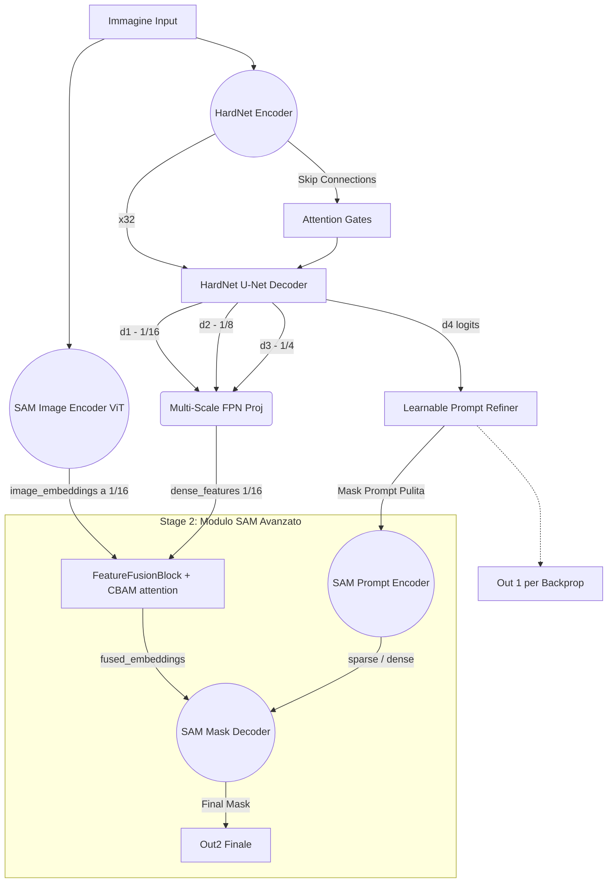

# Architettura Avanzata HardNet-SAM U-Net (`_unet`)

Questo documento descrive dettagliatamente la nuova architettura migliorata del modello `_unet` (`HardNetFeatSegUNet`). Il modello è stato pesantemente potenziato con moduli di attenzione specializzati per colmare il gap semantico tra la rete di primo stage (estrattore locale) e SAM (comprensione globale), con l'obiettivo specifico di massimizzare la rilevazione di piccole lesioni (come la sclerosi multipla).

---

## 1. Origini delle Componenti: Letteratura vs. Custom

L'architettura è un ibrido sofisticato. Di seguito ogni componente chiave, la sua provenienza scientifica e l'obiettivo originale per cui è stato progettato.

### Componenti Derivate da Pubblicazioni Scientifiche (State-of-the-Art)

1. **HarDNet Backbone** (*"HarDNet: A Low Memory Traffic Network", Chao et al., 2019*)
   - **Perché è stato progettato:** Ridurre il traffico di memoria letale per le performance delle CNN mobili, minimizzando il tempo di accesso alla DRAM mantenendo alta l'accuratezza.
   - **Cosa fa qui:** Funge da encoder ultra-veloce ed efficiente nello Stage 1. Estrae 5 livelli di feature scalate (da $1/2$ a $1/32$ della risoluzione originale).

2. **Attention Gate (AG)** (*"Attention U-Net: Learning Where to Look for the Pancreas", Oktay et al., 2018*)
   - **Perché è stato progettato:** Specifico per il medical imaging. Nelle U-Net classiche le skip-connection propagano feature di basso livello all'encoder, ma portano con sé molto "rumore" del background.
   - **Cosa fa qui:** Inserito in `models/hardnet_unet_head.py`. Usa il segnale ad alto livello semantico del decoder come "griglia di filtraggio" per spegnere i pixel irrilevanti (la white-matter sana) nelle skip connections e lasciar passare solo la zona target (la lesione).

3. **Multi-Scale Feature Pyramid (FPN)** (*"Feature Pyramid Networks for Object Detection", Lin et al., 2017*)
   - **Perché è stato progettato:** Risolvere il problema degli oggetti multi-scala fondendo le feature semanticamente forti (bassa risoluzione) con quelle semanticamente deboli ma spazialmente accurate (alta risoluzione).
   - **Cosa fa qui:** In origine SAM riceveva solo la feature map a $1/16$ (troppo schiacciata per micro-lesioni). Ora usiamo un design stile FPN in `HardNetUNetHead` proiettando e sommando i livelli 1/16 (`d1`), 1/8 (`d2`) e 1/4 (`d3`).

4. **CBAM (Spatial & Channel Attention)** (*"CBAM: Convolutional Block Attention Module", Woo et al., 2018*)
   - **Perché è stato progettato:** Regolarizzatore per CNN classiche. L'intuizione è che non tutti i canali (tipi di feature) o tutte le zone spaziali sono ugualmente utili al momento della decisione finale. Usa una Shared MLP e conv 7x7.
   - **Cosa fa qui:** Inserito in `models/sam_unet_decoder.py` (`FeatureFusionBlock`). Quando fondiamo le features del ViT di SAM con quelle di HardNet, non le uniamo alla cieca. Il CBAM sopprime i canali discordanti e guida l'attenzione spaziale per creare una fusione omogenea.

5. **Segment Anything Model (SAM)** (*"Segment Anything", Kirillov et al., 2023*)
   - **Perché è stato progettato:** Un modello fondazionale task-agnostic per segmentare qualsiasi oggetto fornendo dei prompt (punti, box, maschere).
   - **Cosa fa qui:** Funge da raffinatore globale nello Stage 2. L'encoder ViT codifica l'immagine internamente, mentre il `MaskDecoder` riceve i calcoli locali della U-Net come "aiuti" per decidere i bordi finali.

### Componenti "Inventate" / Ingegnerizzazione Custom

1. **FeatureFusionBlock con GroupNorm Pre-Concatenazione** 
   - **L'idea:** I ViT Embeddings hanno una distribuzione definita da un `LayerNorm` stazionario, mentre le convoluzioni HardNet escono da delle `BatchNorm2d`. Concatenarli assieme sbilancia i pesi del modulo CBAM.
   - **Cosa fa:** Ho introdotto una `nn.GroupNorm` sulle feature HardNet proprio prima del `torch.cat()` per livellare l'energia delle due distribuzioni e stabilizzare l'apprendimento della CBAM.

2. **Learnable Prompt Refiner** 
   - **L'idea:** SAM accetta una maschera densa (mask prompt). Tradizionalmente si preleva l'output dello Stage 1 e lo si schiaccia tra 0 e 1 con un semplice `torch.sigmoid()`. Ma i logit grezzi dello stage 1 possono avere bordi sfrangiati o lievi FP.
   - **Cosa fa:** In `models/hardnet_feat_seg_unet.py`. Sostituisce il thresholding rigido con due strati convoluzionali $3 \times 3$ appresi. Questo "mini-modulo" impara a "pulire" la predizione dello Stage 1 (es. smussando bordi spuri) prima di consegnare la maschera-prior a SAM.

---

## 2. Diagramma del Flusso dei Dati (Forward Pass)

Comprendere come comunicano i moduli è vitale. Questo diagramma illustra un'iterazione completa al passaggio dell'immagine.

---

## 3. Spiegazione Passo-Passo dell'Architettura

Quando l'immagine `x` entra in `HardNetFeatSegUNet.forward()`, accade questo:

### Fase 1: Esplorazione Parallela
L'immagine viene copiata in due percorsi. 
- Nel **primo percorso (ViT)**, l'immagine viene tradotta in patch 16x16. La rete capisce il contesto generale (es. "questo è un cervello", "ecco la materia grigia"), producendo gli `image_embeddings`.
- Nel **secondo percorso (HardNet)**, la rete scende a livello microscopico (1/2, 1/4) salvando i dettagli. 

### Fase 2: Raffinamento e Ascesa (Attention U-Net)
Durante la ricostruzione in `HardNetUNetHead`, l'encoder comunica con il decoder. Invece di inviare tutte le texture (rumorose), l'**Attention Gate** viene attivato: chiede al decoder "Cosa stai cercando?" (Gating Signal), poi maschera l'immagine e fa passare solo i dettagli delle lesioni (Skip Connection filtrata).

### Fase 3: Estrazione del Concentrato Multi-Scala
Invece di affidare a SAM solo le feature del livello più profondo, la tecnica **FPN-style** preleva l'output di `d1` (risoluzione 1/16), `d2` (1/8) e `d3` (1/4). Tutto viene portato in asse a 1/16, omogeneizzato a 256 canali e sommato. Ora abbiamo delle `dense_features` ad altissima densità informativa dimensionate per il ViT.

### Fase 4: Preparazione del Prompt (Learnable Refiner)
L'output finale della U-Net deve suggerire a SAM *dove* guardare. Piuttosto che un "sì/no" brutale (Sigmoid), il **Learnable Prompt Refiner** agisce come un correttore di bozze: analizza l'output della UNet, corregge piccole incertezze strutturali imparando un filtro 3x3 e restituisce una morbida e precisa mask-prompt per SAM.

### Fase 5: La Fusione CBAM
Questo è il collante. Abbiamo l'embedding "macro" del ViT e le features "micro" di HardNet. Il `FeatureFusionBlock` le normalizza e le concatena. A questo punto subentra la **CBAM**:
1. *Channel Attention*: Sopprime le mappe di feature irrilevanti e amplifica quelle utili.
2. *Spatial Attention*: Accentra il segnale nelle coordinate esatte dove ci sono variazioni d'intensità rilevanti.

### Fase 6: Risoluzione Definitiva
Il `MaskDecoder` di SAM originale prende gli embedding ibridati col CBAM e la mask-prompt "raffinata". Sfrutta una logica Two-Way Transformer per riordinare tutto ed emette il risultato finale `out2`, portando i falsi positivi/falsi negativi al minimo concepibile dal modello.
